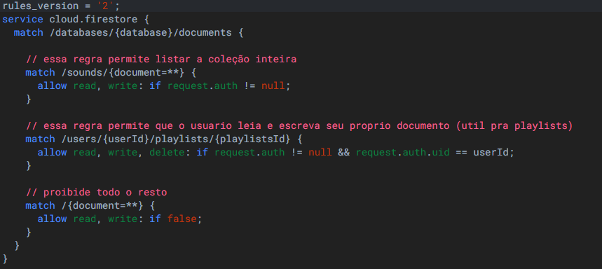

___

# SoundShow - Streaming de Música

 Esta é uma aplicação de streaming de música, construída com React Native (Expo) e Firebase. É um projeto que demonstra o desenvolvimento de uma aplicação de streaming de música do zero, com uma arquitetura e funcionalidades do mundo real.

___

## Tecnologias Utilizadas

[](https://reactnative.dev/) [](https://expo.dev/) [](https://www.typescriptlang.org/) [](https://firebase.google.com/)

___

## Motivação e Objetivo

Este projeto foi construído passo a passo com a motivação de aprender e aplicar conceitos de desenvolvimento mobile.

O objetivo era construir um app que lidasse com **desafios reais**, como:

   **1. Gestão de Estado Global**: Criar um player de música que continua a tocar de forma persistente enquanto o usuário navega entre diferentes telas.

   <br>

   **2. Integração Backend**: Usar o Firebase não apenas para login, mas integrar Auth, Firestore (banco de dados) e Storage (ficheiros) para que funcionem em conjunto.

   <br>

   **3. Consultas**: Implementar um "Ranking Top 5" que exige ordenação (orderBy) e indexação no lado do servidor. E consultas de músicas que o usuário adicionou na sua playlist criada.

   <br>

   **4. Segurança de Dados**: Garantir que as playlists de um usuário sejam privadas e que apenas ele possa vê-las ou editá-las (usando as Regras de Segurança do Firestore).
   <br>

   **i. Regras estabelecidas no Firestore**

   

   <br>

   **5. Navegação Avançada**: Construir um fluxo de autenticação profissional que separa telas públicas (Login) de telas privadas (App) e usa rotas dinâmicas (playlists/[id]).

___

## Telas do App

| Login | Cadastro | Home | Explorar |Playlists | Perfil |
| :---: | :---: | :--- | :--- | :--- | :--- |
|  |  |  |  |  |  |

___

## Funcionalidades Principais

   **1. Autenticação Completa**: Cadastro (signup) e Login (signin) de usuários usando Firebase Authentication (Email/Senha).

   **2. Navegação Protegida**: Um "Porteiro" chamado de layout que redireciona usuários logados para o app e usuários deslogados para o login.

   **3. Player de Música Global**: Um context pra tocar as músicas chamado de AudioPlayerContext que permite que um ***mini-player***  toque música de forma contínua enquanto você navega por todas as abas do app, incluindo telas de detalhes.

   **4. Mini-Player Completo**: A "abinha" na parte inferior da tela mostra a capa, nome, artista, botão de Play/Pause, slider de progresso da música e slider de volume.

   **5. Ranking (Top 5)**: Na tela de inicio, uma query puxa no firestore as 5 músicas mais ouvidas do app.

   **6. Contador de Plays**: O app atualiza automaticamente o playCount, ***usado para o rankeamento*** das músicas no Firestore sempre que ela é tocada.

   **7. Buscar (Explorar)**: Na tela explorar permite pesquisar todas as músicas, seja por nome, artista ou gênero.

   **8. Sistema de Playlists**: Usuário pode criar playlists para agrupar as músicas que gosta.

   **9. Playlists**: o firestore possui uma subcoleção (playlists) dentro da coleção de usuários, onde ele salva todas as playlists criadas pelo próprio usuário

   **10. Adicionar a Playlists**: Um icone de + em cada música abre um Modal que permite ao usuário adicionar aquela música a qualquer uma das suas playlists já criadas.

   **11. Telas de Detalhe Dinâmicas**: Clicar numa playlist navega para uma tela dinâmica que utiliza o ***id*** da playlist coletado no firestore, e que busca e mostra apenas as músicas daquela playlist.

   **12. Gestão de Perfil**: A tela de perfil permite ao usuário atualizar o seu nome e ver as estatisticas do perfil, assim como também é por lá que o usuário faz o logOut clicando no icone do canto superior direito.

___

## Como Rodar este Projeto (Guia Completo)

   **1. Pré-requisitos**

- Node.js (versão LTS)

- Git

- O app Expo Go no seu telemóvel (iOS ou Android)

   **2. Clonar e Instalar**

   ```bash
   git clone https://github.com/KaioLC/soundShow.git
   ```

   **3. Entre na pasta**

   ```bash
      cd soundShow
   ```

   **4. Instale as dependências**

   ```bash
   npm install
   ```

   **5. Instale o slider**

   ```bash
   npx expo install @react-native-community/slider
   ```

   **6. Rodar o App**

   ```bash
   npx expo start -c
   ```

  - Escaneie o QR Code com o app Expo Go
